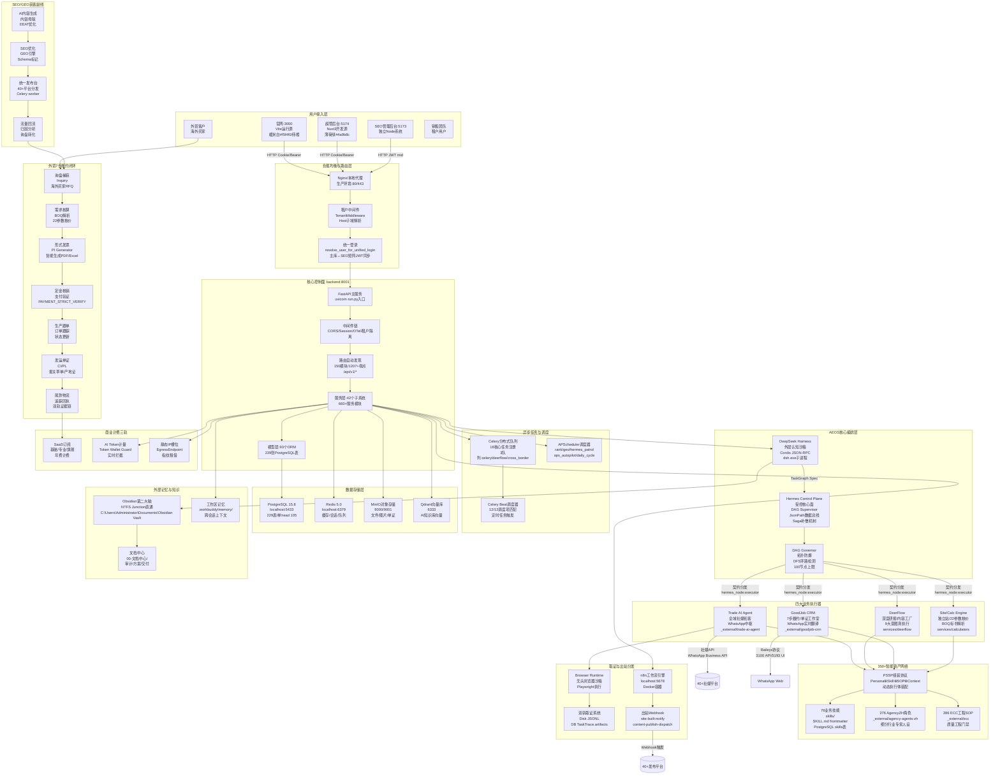
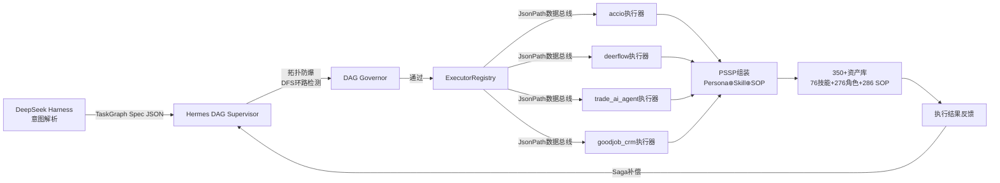
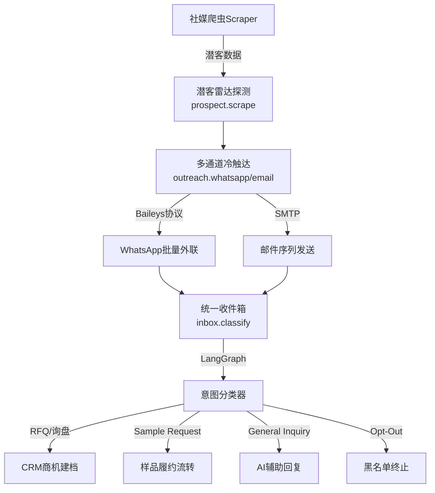
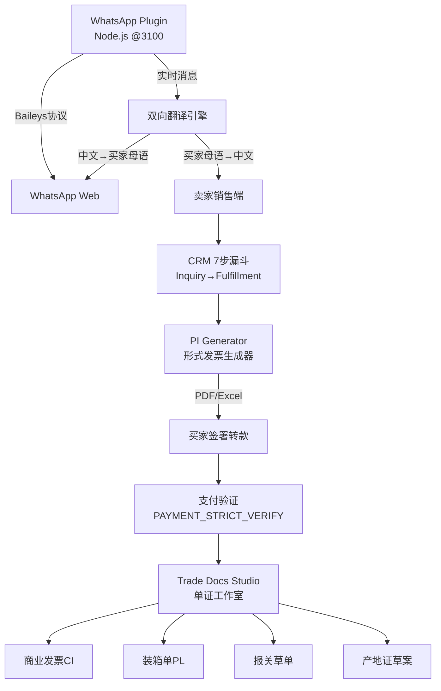
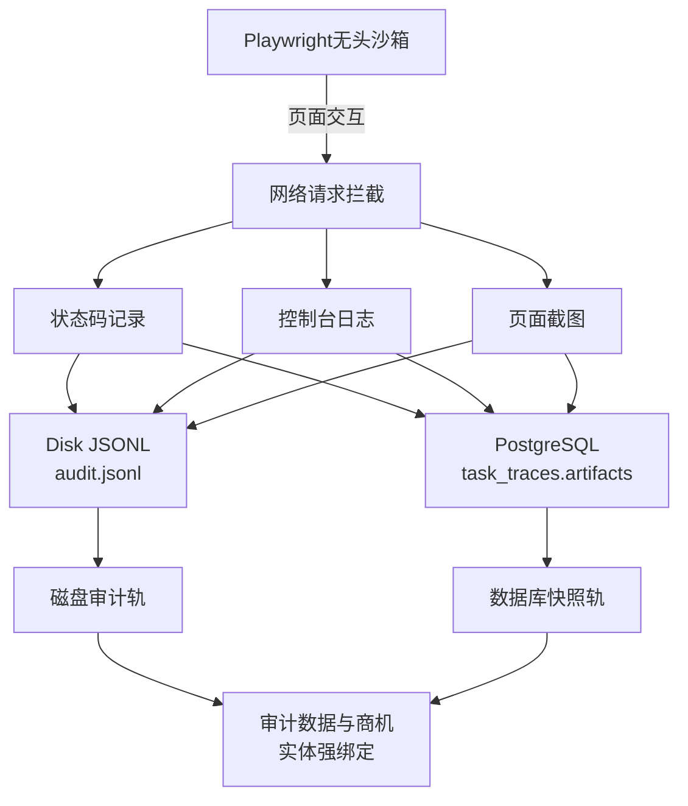
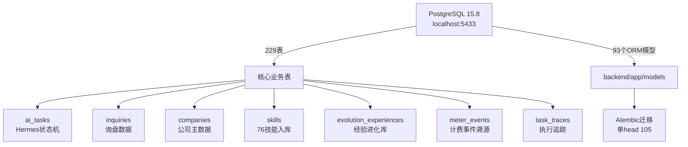

# AEOS 全域系统架构全景图

> 生成时间：2026-09-20
> 用途：系统故障排查、链路追踪、架构优化决策
> 涵盖：八大子系统 + 350+资产 + 全数据流 + 细微组件连接

---

## 完整架构全景图

---

## 细微组件详细连接图

### 1. Hermes DAG编排核心连接

### 2. Trade AI Agent内部组件连接

### 3. GoodJob CRM履约闭环连接

### 4. Browser Runtime双轨取证连接

### 5. 数据库连接拓扑

---

## 缺失的串联环节分析

### 🔴 识别到的关键缺失连接

#### 1. **Trade AI Agent → Hermes 缺少正式适配器**
- **现状**：`AEOS_GLOBAL_SYSTEM_REGISTRY.json` 显示 Trade AI Agent 状态为 `ready_for_adapter`
- **缺失**：缺少 `hermes_node:trade_ai_agent` 的正式适配器实现
- **影响**：无法通过 Hermes DAG 正式调度 Trade AI Agent 的能力
- **建议**：在 `backend/app/services/hermes/executors/` 下创建 `trade_ai_agent_adapter.py`

#### 2. **GoodJob CRM → Hermes 缺少正式适配器**
- **现状**：`AEOS_GLOBAL_SYSTEM_REGISTRY.json` 显示 GoodJob CRM 状态为 `ready_for_adapter`
- **缺失**：缺少 `hermes_node:goodjob_crm` 的正式适配器实现
- **影响**：无法通过 Hermes DAG 正式调度 GoodJob CRM 的履约能力
- **建议**：在 `backend/app/services/hermes/executors/` 下创建 `goodjob_crm_adapter.py`

#### 3. **WhatsApp Plugin → 核心后端 缺少事件总线集成**
- **现状**：WhatsApp Plugin 独立运行在 Node.js @3100，与主后端缺少实时事件同步
- **缺失**：缺少 WebSocket/SSE 事件总线将 WhatsApp 消息实时推送到主后端
- **影响**：CRM 系统无法实时感知 WhatsApp 消息，存在数据同步延迟
- **建议**：实现 WebSocket 服务或使用 Redis Pub/Sub 进行消息同步

#### 4. **Browser Runtime → 证据分析 缺少自动化分析管道**
- **现状**：双轨取证系统收集了证据，但缺少自动化分析
- **缺失**：缺少证据自动分析、异常检测、合规性检查的自动化管道
- **影响**：收集的证据需要人工分析，无法自动发现异常行为
- **建议**：在 `services/browser_runtime/` 下添加 `evidence_analyzer.py`

#### 5. **Experience Engine → 业务决策 缺少反馈闭环**
- **现状**：进化引擎收集了经验数据，但缺少与业务决策的自动反馈
- **缺失**：缺少将进化经验自动应用到业务策略的闭环机制
- **影响**：经验数据无法自动优化业务策略
- **建议**：实现 `services/evolution/feedback_loop.py` 自动应用经验

#### 6. **SEO/GEO内容 → 官网发布 缺少自动化部署**
- **现状**：内容生成和发布分离，缺少自动化部署到官网的流程
- **缺失**：缺少内容自动部署到官网 Vite 运行源的 CI/CD 流程
- **影响**：内容发布需要手动操作，效率低下
- **建议**：实现内容自动部署管道，集成到 n8n 工作流

---

## 建议的优先级修复方案

### P0 (立即修复)
1. **实现 Trade AI Agent Hermes 适配器**
2. **实现 GoodJob CRM Hermes 适配器**
3. **WhatsApp Plugin 事件总线集成**

### P1 (近期修复)
4. **Browser Runtime 证据分析管道**
5. **Experience Engine 反馈闭环**

### P2 (中期优化)
6. **SEO/GEO 内容自动部署**
7. **统一监控告警系统**

---

## 关键端口和服务清单

| 端口 | 服务 | 状态 | 依赖 |
|------|------|------|------|
| 3000 | 官网 (Vite运行源) | 🟢 活跃 | PostgreSQL 5433 |
| 5173 | SEO管理后台 | 🟢 活跃 | MySQL (seo-backend) |
| 5174 | 超管后台 | 🟢 活跃 | PostgreSQL 5433 |
| 5678 | n8n工作流引擎 | 🟢 活跃 | Docker |
| 5433 | PostgreSQL 15.8 | 🟢 活跃 | 原生安装 |
| 6379 | Redis 5.0 | 🟢 活跃 | 原生安装 |
| 3100 | WhatsApp Plugin API | 🟡 待集成 | Node.js |
| 5193 | WhatsApp Plugin UI | 🟡 待集成 | Node.js |
| 8001 | 主后端API | 🟢 活跃 | PostgreSQL + Redis |
| 9000/9001 | MinIO对象存储 | 🟢 活跃 | Docker |
| 6333 | Qdrant向量库 | 🟢 活跃 | 配置项 |

---

## 故障排查决策树

当系统出现问题时，按以下顺序排查：

1. **检查基础服务**：PostgreSQL @5433、Redis @6379、n8n @5678
2. **检查核心后端**：FastAPI @8001 日志、中间件链、租户解析
3. **检查编排层**：Hermes DAG 状态、DAG Governor 日志
4. **检查执行器**：对应执行器的适配器状态、PSSP 组装
5. **检查数据流**：JsonPath 数据总线、Saga 补偿机制
6. **检查取证系统**：Disk JSONL、DB TaskTrace 双轨
7. **检查外部连接**：WhatsApp Plugin、社媒API、发布平台

---

**文档维护**：当架构发生变更时，请及时更新此文档以保持与实际系统的一致性。
