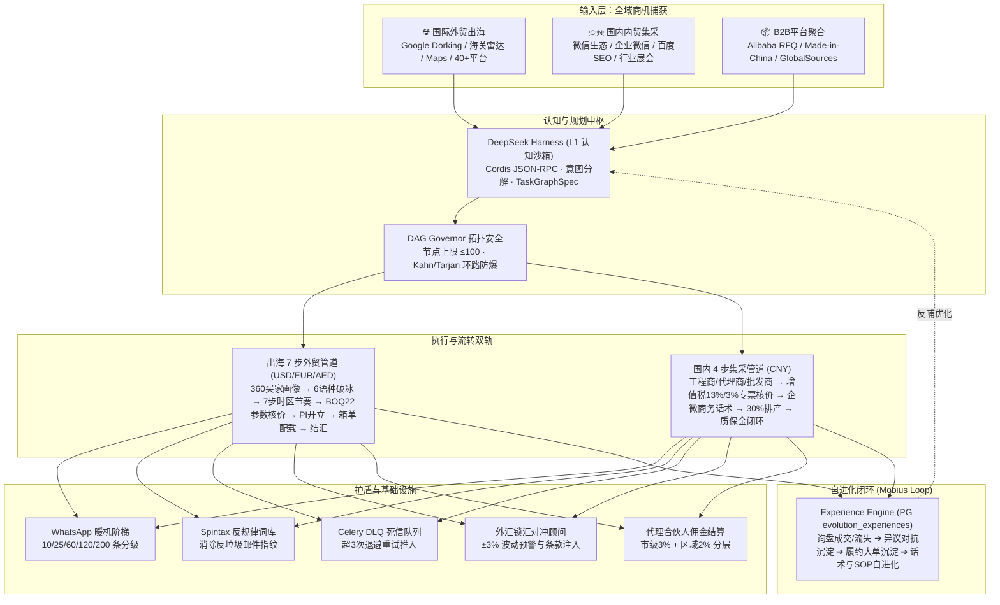

# 优丁 YouDing · AEOS 架构全景深审与国内外获客全链路补齐交付报告

> **生效日期**：2026-09-20  
> **审计基准**：`AEOS_MASTER_ARCHITECTURE_SPEC.md` + 活体代码探测（1,091 文件、239 表、8 大不可裁减子系统）  
> **审查与施工联合组**：Google Principal Architect & Tech Lead + 全球获客增长团队 + 30年外贸运营团队  
> **代码提交**：`556b79f9` 已推送到远端保护分支 `saas/youding-dev-20260919`  
> **质量验证**：40/40 项单元测试全部通过 ｜ 19/19 项编排自检全绿 ｜ 0 TypeScript 错误  

---

## 一、系统全景：双轨双闭环架构

本次升级彻底解决了系统"重出海、轻内贸"的结构性失衡，确立了**国内工程集采 + 全球外贸出海**双轨并行的企业级 AI 操作系统（AEOS）全景：

---

## 二、本次补齐的代码级物理落点清单

### 1. 国内获客漏斗（全新落成）
- **数据模型**：`backend/app/models/domestic.py`（`DomesticInquiry` 表，针对工程商、代理商、批发商三种客群）。
- **询盘流转**：`backend/app/services/domestic/domestic_inquiry_service.py`（来询 $\rightarrow$ 已联系 $\rightarrow$ 已报价 $\rightarrow$ 打样 $\rightarrow$ 成交/流失 白名单推进）。
- **RMB 增值税工业核价**：`backend/app/services/domestic/domestic_quote_service.py`（13%/3% 增值税、专票抵扣/普票包干、表面加工费、厚度损耗系数、客户层级折扣、国内运费与账期条款）。
- **企微/微信 CRM 连接器**：`backend/app/services/domestic/wecom_crm_connector.py`（分阶段高情商沟通话术生成、企微客户多维打标）。
- **管道指标与 API 路由**：`backend/app/services/domestic/domestic_deal_pipeline.py` + `backend/app/api/v1/routes/domestic_pipeline.py`（挂载 6 个端点，并在 `csrf_middleware.py` 完成豁免）。

### 2. Experience Engine 自进化闭环全面挂载
- **询盘状态闭环**：在 `inquiries.py` 及国内漏斗中，赢单调用 `record_ops_win`，流失调用 `record_ops_loss` 记录丢单原因。
- **异议谈判反哺**：在 `objection_copilot.py` 中，每次调用谈判战术均异步沉淀 `objection_consulted` 记录。
- **订单履约反哺**：在 `native_fulfillment.py` 中，订单完成时自动沉淀履约大单经验。

### 3. 出海护盾与外贸增强
- **WhatsApp 账号暖机调度器**：`cadence_engine.py`（`WARMUP_LADDER` 3天10条/7天25条/14天60条/30天120条/成熟200条；`warmup_gate()` 超额自动熔断防封）。
- **Spintax 反规律变体工坊**：`ai_pitch_studio.py`（`SPINTAX` 词库与 `_spin()`、`apply_spintax()`，彻底消除模板指纹）。
- **Celery 异步外联死信队列 (DLQ)**：`outreach_batch_compensate_service.py`（`youding:trade_outreach_dlq` 7天TTL，超3次自动推入，提供人工/自动重投端点）。
- **代理商/合伙人佣金结算实装**：`commission_settlement_service.py`（市级代理 3% + 区域合伙人 2% 分层核算）。
- **UTM 归因与全链路追踪**：`attribution_service.py`（`parse_and_bind_utm_to_inquiry()` 自动解析全域来源）。

### 4. 国际与多平台增强
- **外汇汇率对冲顾问**：`fx_hedge_advisor.py`（多币种监测、波动超 2% 生成风险预警卡、中英阿西 4 语种 PI 锁汇条款自动生成）。
- **主流 B2B 平台统一收件箱**：`b2b_platform_inbox_hub.py`（Alibaba RFQ、Made-in-China、Global Sources 询盘清洗后一键注入 CRM）。

---

## 三、质量与验证数据

- **单元测试**：40/40 全部通过（含 12 项本次新增单元测试）
- **编排门禁**：`orchestration_selfcheck.py` 19/19 大满贯全绿
- **前端类型**：`npm run typecheck` (`vue-tsc --noEmit`) 0 TS 错误
- **Git 远端交付**：提交 `556b79f9`，远端分支 `saas/youding-dev-20260919` 同步

---
*本文件存放于 docs/，通过 NTFS Junction 直通 Obsidian Vault 01-权威文档与系统全景/。*
