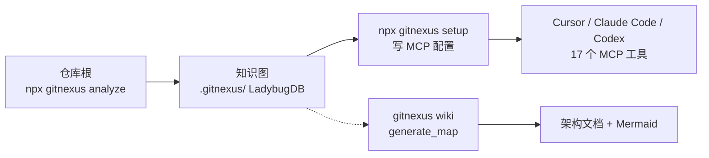
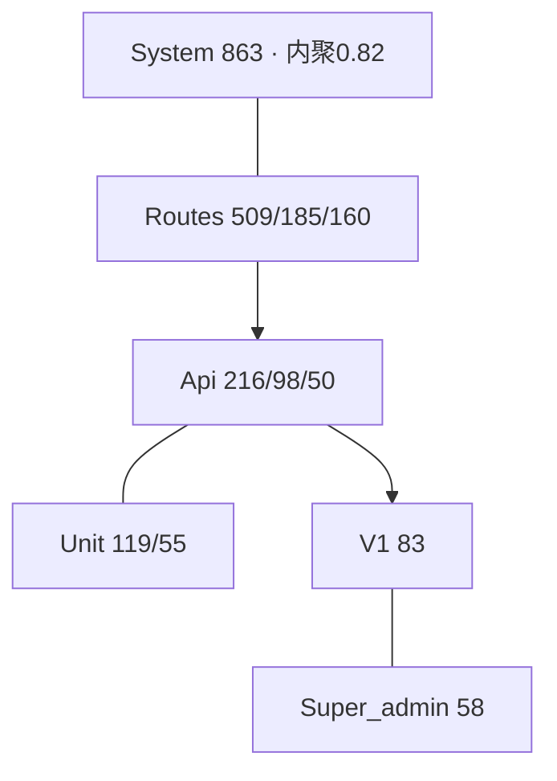
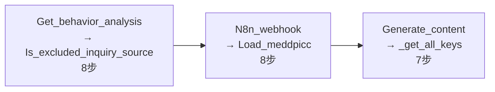
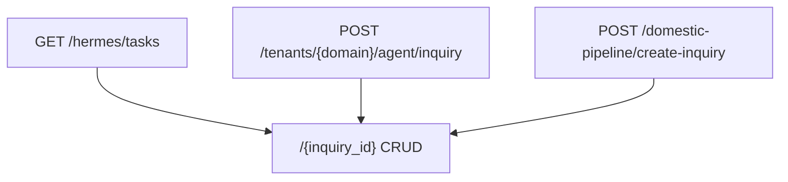
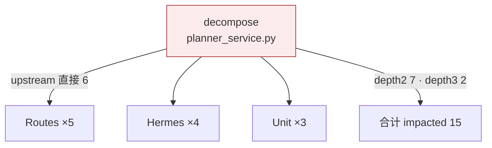

# GitNexus 正确用法 · 画一遍 + 优丁实跑图（2026-09-24）

> 源：https://github.com/abhigyanpatwari/GitNexus  
> 定位：**代码知识图引擎**（DeepWiki 更深一层）——索引依赖/调用链/聚簇/执行流，经 MCP 喂给 Agent。

---

## 一、正确用法（官方 Quick Start）



**必须做对的 5 件事**

| # | 正确姿势 | 反例 |
|---|---|---|
| 1 | 在 **git 仓库根** 跑 analyze | 工作区根非 git → 需 `--skip-git` |
| 2 | **系统 Node**（ABI 137） | MiMo Electron Node → `lbugjs.node` 加载失败 |
| 3 | 装完跑 `@ladybugdb/core/install.js` | allow-scripts 拦 postinstall → 非法 Win32 |
| 4 | 大仓先 `--skip-fts --skip-skills` | 1.6.12 **无** `--skip-embeddings`（默认关） |
| 5 | 用 `cypher/query/impact/trace` 查图 | 只靠肉眼 grep |

---

## 二、优丁 worktree 实跑（正确用法跑通）

```text
analyze --skip-fts --skip-skills --skip-agents-md
→ 122.2s · 76,302 nodes | 143,294 edges | 1,772 clusters | 1,032 flows
→ 4,754 files · commit a0698e7 · feat/deskcomm-unique-integrate
```

### 图 A · 知识图节点构成


### 图 B · 顶层功能聚簇



### 图 C · 最长执行流（Process 实抽）



### 图 D · 关键 Route（2034 条中的样本）



### 图 E · `impact decompose` 爆炸半径（真图查询）



**risk=HIGH** · 改 `decompose` 会波及 Routes/Hermes/Unit 共 15 个上游符号。

---

## 三、以后用图画的命令

| 想干什么 | 命令 |
|---|---|
| 仓库状态 | `gitnexus status` / `list` |
| 谁依赖谁 | `gitnexus impact <symbol>` |
| A→B 调用路径 | `gitnexus trace A B` |
| 自由查图 | `gitnexus cypher "…"` |
| wiki/架构文档 | `gitnexus wiki --lang chinese` |
| 给 Agent 挂图 | `gitnexus setup` |

```powershell
$sys = "C:\Program Files\nodejs\node.exe"
$cli = "C:\Program Files\Xiaomi MiMo\node_modules\gitnexus\dist\cli\index.js"
cd 上线网站.worktrees/agents-install-vscode-cline-deploy-strix
& $sys $cli analyze --skip-fts --skip-skills --skip-agents-md
& $sys $cli impact decompose
```

---

## 四、GitNexus vs Archify

| | GitNexus | Archify |
|---|---|---|
| 输入 | **真实代码**自动抽图 | 手写 JSON IR |
| 强项 | 调用链 / 影响面 / 2034 Route | 精美交互叙事图 |
| 建议 | **先抽真结构** | 再灌进 Archify 展示 |
