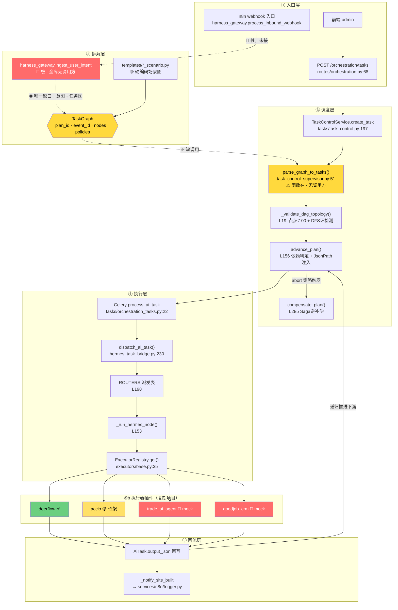
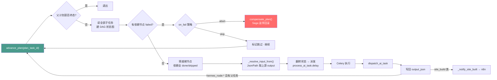
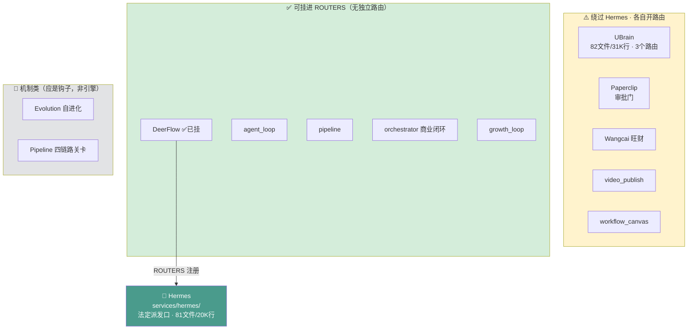
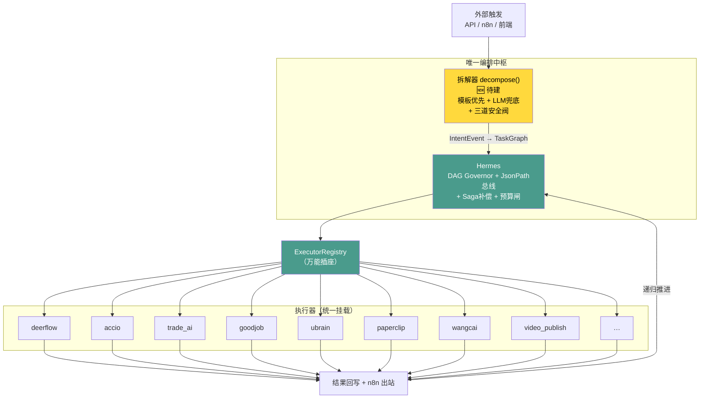
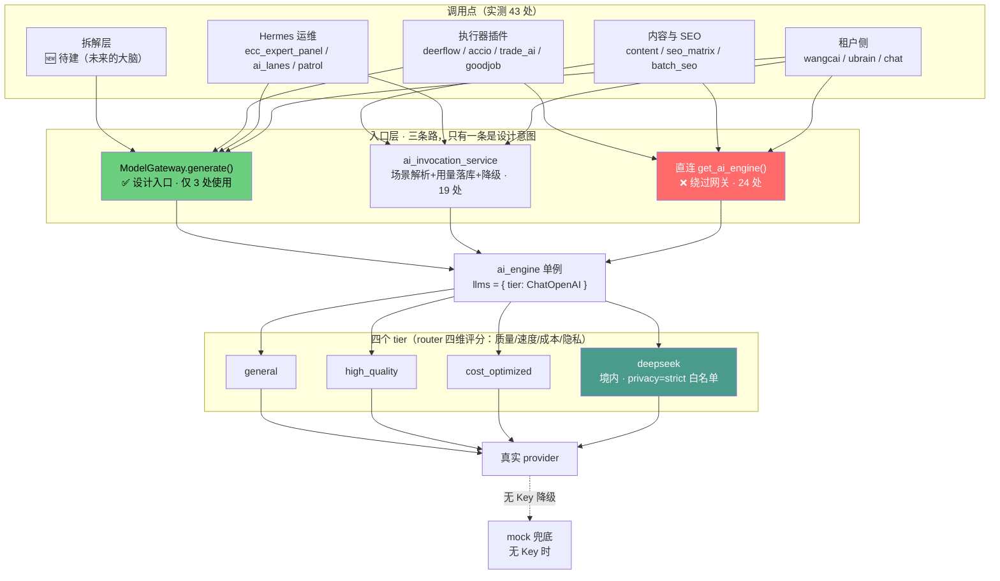
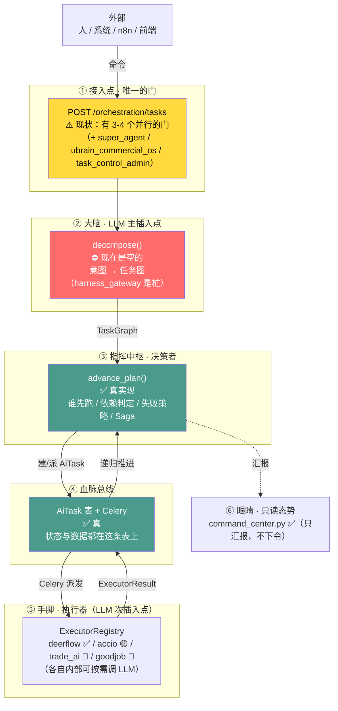

# 串联拓扑图 · 调度关系点对点

> **日期**：2026-09-10 ｜ **依据**：源码实测（每条边都已核实，非推断）
> **配套**：`串联驱动设计-2026-09-10.md`（设计）、`编排链路真伪核验-2026-09-10.md`（真伪）
> **图例**：✅真实现 ｜ 🟡部分/骨架 ｜ 🔴桩/mock ｜ ⚫不存在 ｜ ⋯虚线=未接通

---

## 图 1 · 五层主链路（完整调度关系）

**读图要点**：绿色=真跑，黄色=待接，红色=桩。**红色虚线那一段是唯一缺口**——意图进不来，所以下游再通也没用。

---

## 图 2 · 调度内核细节（递归派发环）

**关键**：`M -->|hermes_node 且有父| A` 这条回边——**节点执行完会回到 `advance_plan` 推进下一批**，构成递归派发环。这是整条链能自动跑下去的原因。

---

## 图 3 · 12 个编排引擎的现状（谁归谁）

**判据**（决定谁该降级、谁该挂载）：
> 同时有「自己的路由 + 自己的状态机 + 自己的对外入口」= **平行系统**，该降级
> 只有前两者 = **执行器**，该挂进 `ROUTERS`

---

## 图 4 · 收敛目标态（终局）

**对比图 3 与图 4**：现状是「1 个中枢 + 5 个平行系统 + 5 个散件」；目标态是「1 个中枢 + 1 个插座 + N 个执行器」。**收敛就是把这个差集消灭掉。**

---

## 图 5 · 大模型驱动链路（补漏）

> **这一层之前漏了，而它决定「谁有智能」。**

### 关键事实（实测）

| 项 | 实测值 |
|---|---|
| 直连 `get_ai_engine()`（绕过网关） | **24 处** |
| 走 `ai_invocation_service` | 19 处 |
| 走 `ModelGateway`（设计入口） | **仅 3 处** |
| ai_engine 是否为单例 | ✅ 是（`get_ai_engine()`），**所有调用点共享同一实例** |
| tier 数 | 4（general / high_quality / cost_optimized / deepseek） |
| 能力标签 | 8（reasoning / coding / vision / writing / translation / structured_output / cheap / fast） |
| DeepSeek 当前是否启用 | ❌ **Key 为空**（`AI_DEEPSEEK_API_KEY=`），`_init_deepseek_llm()` 直接跳过 |

### 回答「用 DeepSeek 驱动，是驱动一个还是全部？」

**分三层看：**

1. **引擎层：是「一个」** —— `get_ai_engine()` 是单例，43 个调用点拿的是**同一个实例**。所以配置是全局的，配一次全生效。

2. **路由层：不是「全部用同一个模型」** —— 单例内部按 **tier 分槽**（`llms = {tier: ChatOpenAI}`）。DeepSeek 注册进的是 `llms["deepseek"]` **和** `llms["cost_optimized"]`（**兼任成本优化档**）。所以：
   - 场景命中 `deepseek` / `cost_optimized` → 走 DeepSeek
   - 场景命中 `logic`（推理）→ 走逻辑模型
   - 场景命中 `multilingual` → 走多语言模型（Gemini）
   - **配了 DeepSeek ≠ 全部用 DeepSeek**

3. **网关层：本该统一，实际形同虚设** —— `ModelGateway` 是设计好的统一入口（能力路由 + 成本记账 + `privacy=strict` 合规闸门），但 **43 处里只有 3 处走它**，24 处直接绕过。

### 对设计的修正

**原先设计的「拆解器」只说了用 LLM，没说清用哪个、走哪条路。补正：**

- **拆解器必须走 `ModelGateway`**（不是直连 `ai_engine`），理由有三：
  1. **成本记账** —— 拆解是高频调用，必须进 `model_call_ledger`
  2. **合规闸门** —— 租户需求可能含敏感信息，`privacy=strict` 只允许境内 provider（DeepSeek 档）
  3. **预算控制** —— `GraphPolicies.budget_cap` 要靠网关的 ledger 才落得下去
- **拆解器用 `reasoning` 能力标签**（→ `logic` tier），不是 `general`
- **要真正用上 DeepSeek，得先配 `AI_DEEPSEEK_API_KEY`**（现在是空的）

> **一句话**：模型是「一个引擎、四个槽、多条路」——**配置是全局的，但走哪个槽由场景决定；而入口本该统一到网关，现在只有 3/43 走对了。**

---

## 图 6 · 控制脊柱（谁接命令 → 谁指挥 → 谁干活）

> **你要的「一个接收命令、指挥背后干活」的关系。结论：那个位置现在是空的。**

### 六个角色，现在各是谁

| 角色 | 应是什么 | 现在是谁 | 状态 |
|---|---|---|---|
| **① 接入点** | 唯一的门 | `POST /orchestration/tasks`（**另有 3 个并行门**：`super_agent` / `ubrain_commercial_os` / `task_control_admin`） | ⚠️ **不唯一** |
| **② 大脑** | LLM 把需求变任务图 | **无**（`harness_gateway` 是桩、无人调用） | ⛔ **空** |
| **③ 指挥中枢** | 决定谁跑/先后/失败怎么办 | `advance_plan()` + `dispatch_ai_task()` | ✅ 真 |
| **④ 血脉总线** | 承载状态与数据 | `AiTask` 表 + Celery | ✅ 真 |
| **⑤ 手脚** | 干活 | `ExecutorRegistry`（4 执行器） | 🟡 2/4 mock |
| **⑥ 眼睛** | 只读态势 | `command_center.py` | ✅ 真（**但只读，不是指挥**） |

### 回答你的三个问题

**Q：这一整条链路是谁？**
**`AiTask` 表就是这条链路的本身。** 所有节点都是 `AiTask` 记录，状态存在表里，Celery 消费它，`advance_plan()` 遍历它推进。**这不是比喻——链路就是这张表。**

**Q：从哪驱动插入？**
- 想驱动**一个任务** → `POST /api/v1/orchestration/tasks`（**现在就能用**，无需改代码）
- 想驱动**一个需求 → 自动带出全部** → 插在 **② 大脑** 位置（`decompose()`，**待建**）

**Q：大模型从哪插入？**
| 插入点 | 位置 | 作用 | 状态 |
|---|---|---|---|
| **主插入点（大脑）** | ② `decompose()` | 把「一句话需求」拆成 `TaskGraph`，**一个大脑驱动全部下游** | ⛔ 待建 |
| 次插入点（手脚） | ⑤ 各执行器内部 | 按需调用：写文案、翻译、生成视频脚本 | 🟡 部分 |

**你描述的「驱动一个，连带着自动驱动全部」——这是对的，而且那个"一个"就是 ② 的 `decompose()`。** 它产出 `TaskGraph` 后，③→④→⑤ 会自动跑起来（递归派发环保证）。**现在缺的就是这个大脑。**

### 为什么必须补在 ②，不能补在别处

- 补在 ① → 只是多一个门，还是不会拆解
- 补在 ③ → `advance_plan()` 只能处理**已有**的图，不会造图
- 补在 ⑤ → 那是"手脚自己想办法"，不叫大脑，且违背「一切执行经 Hermes」

**只有 ② 能让「一个命令 → 自动带出全部」。**

---

## 附 · 关键连接点速查（点对点）

| 从 | 到 | 位置 | 状态 |
|---|---|---|---|
| 前端 / 外部 | `POST /orchestration/tasks` | `routes/orchestration.py:68` | ✅ |
| 路由 | `TaskControlService.create_task` | `tasks/task_control.py:197` | ✅ |
| create_task | AiTask（写库） | — | ✅ |
| AiTask | `process_ai_task.delay` | `routes/orchestration.py:93` | ✅ |
| Celery | `dispatch_ai_task` | `tasks/orchestration_tasks.py:22` | ✅ |
| dispatch | `ROUTERS[task_type]` | `hermes_task_bridge.py:244` | ✅ |
| dispatch | `_run_hermes_node` | `hermes_task_bridge.py:245` | ✅ |
| `_run_hermes_node` | `ExecutorRegistry.get()` | `hermes_task_bridge.py:160` | ✅ |
| 执行器 | 写回 `output_json` | `hermes_task_bridge.py:262` | ✅ |
| 写回 | `advance_plan(父)` | `hermes_task_bridge.py:276` | ✅ |
| `advance_plan` | 派发下游 | `task_control_supervisor.py:257` | ✅ |
| `advance_plan` | `process_ai_task.delay` | 同上 | ✅ |
| site_build 完成 | `_notify_site_built` → n8n | `hermes_task_bridge.py:272` | ✅ |
| 节点失败 abort | `compensate_plan` | `task_control_supervisor.py:212` | ✅ |
| **IntentEvent** | **TaskGraph** | — | ⛔ **缺口** |
| **TaskGraph** | **`parse_graph_to_tasks`** | `task_control_supervisor.py:51` | ⚠️ **无调用方** |
| n8n webhook | `harness_gateway` | — | 🔴 **桩** |

**14 条边全部实测。** 其中 **11 条 ✅、1 条 ⚠️、2 条 ⛔/🔴**——这就是全部的断点。

---

*本拓扑由 Claude 于 2026-09-10 依据源码实测绘制。Mermaid 语法，Obsidian / GitHub / VS Code 可直接渲染。*
