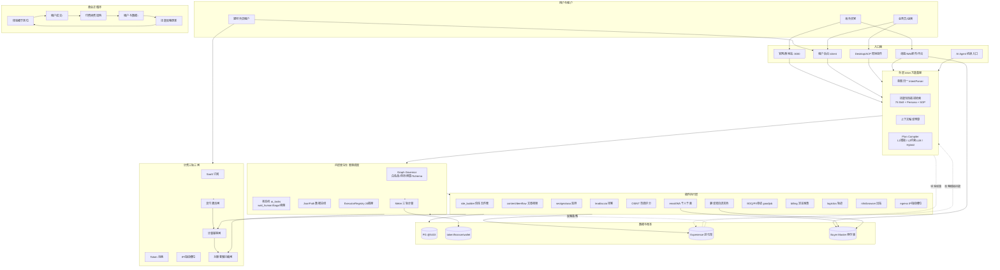
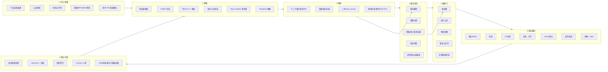
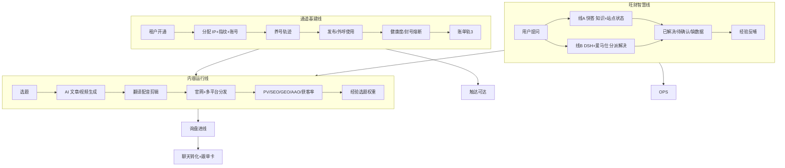
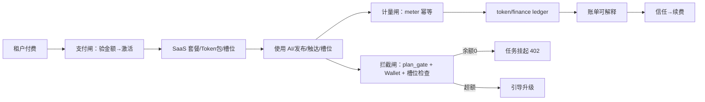
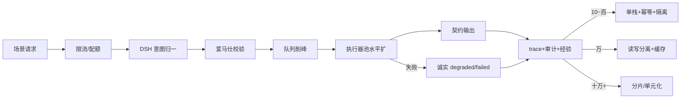

# 优丁获客 OS · 完整拓扑图 + 查缺补漏

> **北极星**：获客全链路丝滑 + 外贸获客莫比乌斯 + 商业正循环  
> **公式**：外层 DSH 万能基座 × 内层爱马仕智慧调度 → 编排串联 > N  
> **权威**：第二大脑 00/06/08/18 · 细胞总谱 · 三轨三闸 · 规模与正确性  
> **日期**：2026-09-14

---

## 1. 总拓扑（一图看全）



---

## 2. 获客主链路拓扑（丝滑细节）



---

## 3. 内容 + 基建 + 旺财 并行拓扑



---

## 4. 计费三轨三闸拓扑



---

## 5. 规模与正确性拓扑



---

## 6. 全域模块索引（拓扑节点 → 文档/细胞）

| 拓扑块 | 细胞/文档 |
|--------|-----------|
| DSH 基座 | 总谱 N/ACQ · 先进架构 · skills |
| 爱马仕调度 | planner/supervisor/executors · 状态机 S-ACQ-07 |
| 获客链 | 18 手册 · 08§9-17 · 调查报告 |
| 跟单卡 | ACQ-E-06 · U-01 |
| 翻译/身份 | 08§12 · Buyer Master |
| 内容指标 | 08§14/§15 · ContentRun |
| 养号IP | 08§16 · Slot E/S |
| 旺财 | 08§11 |
| 信任建站 | 08§13 |
| 计费 | 08§19 · 三轨三闸 |
| 莫比乌斯 | 莫比乌斯细部设计 |
| 商业环 | 00 商业莫比乌斯 |
| 规模正确 | 规模与正确性设计 |
| 细胞施工 | 细胞级总谱 W1-W10 |

---

## 7. 查缺补漏（对照全拓扑）

### 7.1 已相对扎实

| 项 | 状态 |
|----|------|
| 架构叙事 DSH×爱马仕×编排超加和 | 主理人已确认对齐 |
| 业务全链路说明书 18 | 有 |
| 细部 08§9–19 | 有 |
| 细胞总谱骨架 | 有 |
| 计费模型与代码骨架 meter/ledger | 有 |
| 硬锁与诚实原则 | 有 |
| 代码真伪调查 | 有 |

### 7.2 拓扑上仍「空心」的环节（漏）

| # | 缺口 | 拓扑位置 | 影响 | 优先级 |
|---|------|----------|------|--------|
| 1 | **L1 拓客图未含 OSINT/海关/千人千面强制节点** | ACQ→TOUCH | 编排与检查单不一致 | P0 |
| 2 | **回复意图→询盘→跟单卡未产品化** | CHAT→OPS_C | 聊一半系统无感 | P0 |
| 3 | **跟单卡 UI/API 未实现** | OPS_C | 租户仍用 Excel | P0 |
| 4 | **双向翻译未挂获客窗口 UI** | CHAT.C1 | 能力有服务无入口 | P0 |
| 5 | **身份锁 Buyer Master 全渠道强制** | ACQ.A5 | 人设漂移风险 | P0 |
| 6 | **流失因果 UI/字段** | LOOP.L1 | 无因果难进化 | P0 |
| 7 | **Playbook 提醒进线推送** | ACQ.A6 | 「印度全款」等不落地 | P1 |
| 8 | **优差评分前端展示+理由** | ACQ.A3 | 不可解释 | P1 |
| 9 | **样品 Sample 流程** | CLOSE.F2 | 工程单缺环 | P1 |
| 10 | **开发信千人千面与背调强制序** | TOUCH | 现多为模板信 | P1 |
| 11 | **首封人审 env 默认关** | TOUCH.T3 | 合规风险 | P0 |
| 12 | **渠道 mock 未在 UI 红标** | ACQ | 假线索当真 | P0 |
| 13 | **内容→询盘归因字段贯通** | CNT.CM | 获客率算不准 | P1 |
| 14 | **视频运行指标看板** | CNT | §15 未实现 | P1 |
| 15 | **IP/指纹分配+账单闭环** | INFRA.IB | 轨3未收口 | P1 |
| 16 | **Token Wallet Guard 硬拦** | BILLING.G3 | 白嫖风险 | P0 |
| 17 | **生产支付严格验签** | G1 | 假支付风险 | P0 |
| 18 | **Win/Loss + 渠道归因** | LOOP.L2 | 莫比乌斯缺血 | P1 |
| 19 | **经验双源统一（JSON→PG）** | LOOP | 反哺不可靠 | P1 |
| 20 | **编排词典（abc/acb…）** | DSH→PLUG | 场景未词典化 | P1 |
| 21 | **旺财线B 接爱马仕** | WANG | 复读风险 | P1 |
| 22 | **信任门禁发布阻断** | PREP.P3 | 假信任 | P1 |
| 23 | **经销商/招投标航道** | ACQ | 建材大单缺 | P2 |
| 24 | **单元化/分片设计落地** | 规模 | 万级未验 | P2 |
| 25 | **对账巡检任务** | BILLING | 误差无人看 | P1 |

### 7.3 按波次收口（拓扑补洞顺序）

| 波次 | 补洞 | 补完后拓扑段是否闭合 |
|------|------|----------------------|
| **W1** | 跟单卡 E/U/A | OPS_C 闭合 |
| **W2** | 双语会话+意图→询盘 | CHAT 闭合 |
| **W3** | 人审+mock 红标+Wallet/支付闸 | TOUCH+BILLING 半闭合 |
| **W4** | 评分理由+Playbook 提醒 | ACQ 闭合 |
| **W5** | 流失因果+时间线 | LOOP 输入闭合 |
| **W6** | L1 拓客图全节点 | ACQ-TOUCH 编排闭合 |
| **W7** | 内容归因+获客率看板 | CNT 闭合 |
| **W8** | 槽位分配账单 | INFRA 轨3 闭合 |
| **W9** | 经验 PG 真源+反哺可观测 | LOOP 全闭合 |
| **W10** | 旺财线B+商业指标 | WANG+COMM 闭合 |

### 7.4 拓扑完整判定（DoD）

```text
拓扑完整 = 每条实线边都有：
  接口或编排节点 + 状态机 + 账单埋点（若计费）
  + 诚实降级 + 可观测指标 + 经验回写点

任一边是「文档有、代码无」→ 空心边 → 未闭合
```

---

## 8. 一句话总结

**完整拓扑 = 入口 × DSH × 爱马仕 × 插件（获客/内容/基建/履约）× 数据经验 × 三轨三闸 × 商业正循环。**

当前：**骨架与设计齐，约 25 处空心边**；按 **W1→W10** 焊完空心边，即达成「获客全链路丝滑 + 莫比乌斯 + 付费正循环」。

---

## 9. 文档总目录（本会话沉淀）

| 文档 | 用途 |
|------|------|
| 本文 | **总拓扑 + 查缺补漏** |
| 细胞级总谱 | 施工编号与 W 波次 |
| 18 全链路手册 | 外贸业务说明书 |
| 08 §8–19 | 细部检查单 |
| 获客调查报告 | 代码真伪 |
| 莫比乌斯细部 | 经验环 |
| 三轨三闸 | 计费把控 |
| 规模与正确性 | 扩容与不出错 |
| DSH×爱马仕 架构/蓝图 | 编排设计 |
| 00 北极星+商业环 | 目标锁定 |

---

*下一步：说「W1 开工」即从跟单卡焊第一条空心边。*
