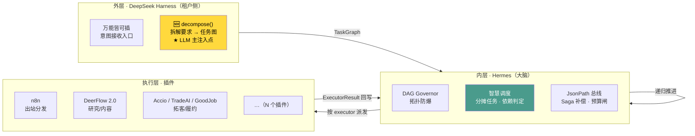

# 全链路串联设计 · 总纲

> **日期**：2026-09-10 ｜ **性质**：收口设计（架构层 × 业务层合一）
> **依据**：源码实测（`串联拓扑图-2026-09-10.md`）+ 契约（`schemas/hermes_orchestration.py`）+ 业务链
> **目标架构**：**外层 Harness 拆解需求 → 内层 Hermes 智慧调度 → n8n / DeerFlow 执行 → 调动插件 → 产出不同结果**

---

## 0. 一句话结论

**你描述的两个东西——「架构驱动链」和「外贸业务链」——是同一件事的两面：业务链的每一步，就是任务图里的一个节点。**

设计要做的事只有一件：**把业务链翻译成 `TaskGraph`，由 Hermes 自动跑完。** 而缺的只有「翻译器」这一个部件（`decompose()`）。

---

## 1. 架构三层（已定型）



**三层职责**：
- **外层** = 听得懂人话（意图 → 图）
- **内层** = 知道怎么干（图 → 任务 → 派发 → 推进）
- **执行层** = 真干活（插件）

---

## 2. 业务链路 → 执行器映射（18 步全表）

> 你列的链路，逐步落到「节点能力 + 用哪个插件 + 代码载体 + 现状」

| # | 业务步 | capability | 承载代码（已有） | 插件化 | 现状 |
|---|---|---|---|---|---|
| 1 | 客户上传图片 | `asset.ingest` | `media_factory` / `product_images` | 🆕 待封装 | ✅ 服务在 |
| 2 | AI 自动建站 | `site.generate` | `ai_site_engine.py` + `site_builder/orchestrator.py` | 🆕 待封装 | ✅ 服务真 |
| 3 | 发新闻 / 发产品 | `content.create` | `content_master.py` | 🆕 待封装 | ✅ 服务真 |
| 4 | 上传图片（素材） | `asset.ingest` | `product_images` | 🆕 | ✅ |
| 5 | 生产视频 | `media.video` | `video_publish_orchestrator.py` + `media_factory` | 🆕 | ✅ 服务真 |
| 6 | 多平台分发 | `publish.multi` | `unified_publish.py` + `n8n` | ✅ **n8n 插件在** | 🟡 n8n 工作流是桩 |
| 7 | **养号**（多平台账号养护 / 矩阵） | `social.nurture` | `social_nurture_service.py`(33KB) + `nurture_execution_scheduler.py` + `nurture_execution_worker.py` | 🆕 待封装 | ✅ **服务真**（8 端点：rules/cycles/transition/check/advance/worker-tick/schedule） |
| 8 | 互动回流获客 | `engagement.capture` | `social_interactions` / `inquiries` | 🆕 | ✅ |
| 9 | 多论坛获客发帖 | `forum.post` | `forum.py` / `social_nurture` | 🆕 | 🟡 部分 |
| 10 | 各渠道获客 | `lead.acquire` | `lead_generation` / `prospect_research` | 🆕 | ✅ |
| 11 | SEO / GEO / AAO | `seo.optimize` | `seo_matrix.py` + `geo_engine` | 🆕 | ✅ 服务真 |
| 12 | 写开发信 | `outreach.letter` | `ubrain/accio_sales_service.py` | ✅ **accio 插件在** | 🟡 骨架 |
| 13 | 做背调 | `research.due_diligence` | `prospect_research` / `trade_intel` | 🆕 | ✅ |
| 14 | 获客管理 | `crm.lead` | `crm_pipeline.py` / `opportunity.py` | 🆕 | ✅ |
| 15 | 跟踪客户管理 | `crm.track` | `crm_pipeline` / `opportunity_stages` | 🆕 | ✅ |
| 16 | 订单发货 | `order.fulfill` | ⚠️ **`orders` 表在但无路由** | 🆕 待建 | ⛔ **入口缺失** |
| 17 | 物流跟踪 | `logistics.track` | `logistics.py` | 🆕 | ✅ |
| 18 | 询盘/履约单证 | `trade.docs` | `cross_border/export-quote` + `goodjob` | ✅ **goodjob 插件在** | 🔴 mock |

**两条最重要的结论：**

1. **业务能力九成都在，缺的是「插件化封装」。** 建站、内容、视频、养号、SEO、背调、CRM、物流的服务代码全都是真的——它们只是**没被包成 executor 插件**，所以 Hermes 调度不到它们。
2. **真正空白只剩一处**：**第 16 步「订单发货」**（`orders` 表在、路由不在）。

> **勘误（2026-09-10）**：本表早期版本把第 7 步写成「自动规则（摇号）」，列为"空白"。经查证——**「摇号」是语音输入误识别**，原文是 **「养号」**（社媒账号养护 / 多平台矩阵）。且该项**并非空白**：`social_nurture_service.py`（33KB）+ 独立调度器与 worker + 8 个端点，是**真实现**，只是尚未插件化。已在表中更正。

---

## 3. 一张 TaskGraph 跑完整个链路（真实示例）

以下是用**真实契约字段**（`TaskNode`/`TaskGraph`）写的示例，展示「上传图片 → 建站 → 内容 → 视频 → 分发 → 获客」这条支线怎么落成图：

```json
{
  "plan_id": "plan-site-launch-001",
  "event_id": "evt-tenant-upload-001",
  "strategy": "standard",
  "policies": {
    "max_parallel": 3,
    "budget_cap": {"max_tokens": 200000, "max_seconds": 3600},
    "approval_required": ["publish.multi"],
    "degradation": "skip_non_critical"
  },
  "nodes": [
    {
      "id": "n1",
      "executor": "site_builder",
      "capability": "site.generate",
      "depends_on": [],
      "input": {"tenant_id": "t-001", "industry": "建材"},
      "input_from": {"product_images": "n0.output.urls"},
      "on_fail": "abort",
      "compensation_action": "site.draft.delete"
    },
    {
      "id": "n2",
      "executor": "content",
      "capability": "content.create",
      "depends_on": ["n1"],
      "input_from": {"site_id": "n1.output.site_id"},
      "sop_ref": "ecc/skills/content-engine",
      "model_hint": "deepseek",
      "retry": {"max": 2, "backoff": "exp"}
    },
    {
      "id": "n3",
      "executor": "media",
      "capability": "media.video",
      "depends_on": ["n1"],
      "input_from": {"images": "n0.output.urls", "script": "n2.output.body"},
      "on_fail": "skip"
    },
    {
      "id": "n4",
      "executor": "n8n",
      "capability": "publish.multi",
      "depends_on": ["n2", "n3"],
      "input_from": {"content_id": "n2.output.id", "video_id": "n3.output.id"},
      "on_fail": "degrade:n4_fallback"
    },
    {
      "id": "n5",
      "executor": "deerflow",
      "capability": "seo.optimize",
      "depends_on": ["n2"],
      "input_from": {"url": "n1.output.url"},
      "sop_ref": "ecc/skills/ai-seo"
    },
    {
      "id": "n6",
      "executor": "accio",
      "capability": "outreach.letter",
      "depends_on": ["n5"],
      "input_from": {"site_url": "n1.output.url"},
      "budget": {"max_tokens": 20000}
    }
  ]
}
```

**这张图说明了五件事：**

| 契约字段 | 在本例中的作用 |
|---|---|
| `input_from` | **数据总线**：n2 的文案喂给 n3 生成视频、n4 分发；n1 的站点 URL 喂给 n5 做 SEO |
| `depends_on` | **并行与串行**：n2/n3 可并行（都只依赖 n1），n4 必须等两者完成 |
| `sop_ref` | **ECC 注入**：n2 挂内容引擎 SOP、n5 挂 AI-SEO SOP |
| `compensation_action` | **Saga**：建站失败则删掉草稿站，不留垃圾 |
| `GraphPolicies` | **闸门**：分发要人工审批、总预算 20 万 token、非关键节点可跳过 |

**这张图就是你要的「拆解」。** 而它现在是**人写的**——`decompose()` 要做的是**让 LLM 从一句"帮我建站并推广"自动生成它**。

---

## 4. 大模型注入点（两个）

| 注入点 | 位置 | 干什么 | 走哪条路 |
|---|---|---|---|
| **主：拆解** | ② `decompose()` | 自然语言 → `TaskGraph` | **`ModelGateway`** + `reasoning` 能力（→ `logic` tier） |
| 次：执行 | ⑤ 各执行器内部 | 写文案 / 翻译 / 生成脚本 | 各执行器自行调用（也建议走网关） |

**主注入点必须走 `ModelGateway`**（三个理由：成本记账 / `privacy=strict` 合规闸门 / `budget_cap` 落地）。

**而 DeepSeek 要真正用上，需两件事**：① 配 `AI_DEEPSEEK_API_KEY`（现在是空的）；② 让拆解场景命中 `deepseek` 或 `cost_optimized` 档。

---

## 5. 插件清单（"万能皆可插"的插座）

> **2026-09-10 实测订正（只改数字与状态，不改本节设计判断）**
> 口径来源：`tools/verify_executors.py` 实跑 + `docs/能力台账/归属表.md`。
> 本节原文写「只有 4 个插件、业务链需要约 14 个」，是**四执行器时期**的快照，现已过期。

**现状**：`ExecutorRegistry` 已注册 **9 个插件**；业务链的真实缺口不是"再封 14 个壳"，而是归属表里那 **112 个 `to-orchestrate` 模块 / 17 个接线点**（清单见 `docs/能力串联接线图-2026-09-10.md` §三）。

| 已注册插件（9） | 对应业务 | 状态 |
|---|---|---|
| `deerflow` | 研究 / 内容 / SEO | ✅ 真（09-10 端到端实测通） |
| `site_builder` | ①② 建站 | ✅ 真 |
| `content` | ③ 内容 | ✅ 真 |
| `publish` | ⑥ 分发 | ✅ 真发（未配凭证的渠道记 skipped，不假成功） |
| `egress` | ⑥ 出站 n8n | ✅ 真 |
| `nurture` | 养号 | ✅ 真（见 §2 勘误） |
| `accio` | 开发信 / 销售飞轮 | 🟡 骨架 |
| `trade_ai_agent` | 社媒拓客 / WhatsApp | 🔴 mock（产出带 `simulated:true`） |
| `goodjob_crm` | 履约 / 单证 | 🔴 mock（产出带 `simulated:true`） |

| 待封装插件 | 对应业务步 | 承载代码（已有） |
|---|---|---|
| `site_builder` | ①② 建站 | `ai_site_engine.py` ｜ ✅ 已封装 |
| `content` | ③ 内容 | `content_master.py` ｜ ✅ 已封装 |
| `media` | ④⑤ 图片/视频 | `media_factory` / `video_publish_orchestrator.py` |
| `publish`（或 n8n） | ⑥ 分发 | `unified_publish.py` ｜ ✅ 已封装 |
| `seo` | ⑪ SEO/GEO/AAO | `seo_matrix.py` |
| `research` | ⑬ 背调 | `prospect_research` / `trade_intel` |
| `crm` | ⑭⑮ 客户管理 | `crm_pipeline.py` |
| `order` | ⑯ 订单 | ⛔ **需先补路由** |
| `logistics` | ⑰ 物流 | `logistics.py` |

> **关键点：这些不是"要开发新能力"，而是"给已有能力套一个 executor 外壳"。** 每个外壳约 50-100 行（实现 `BaseExecutor.run()`）。

**同时建议**：把 `hermes_task_bridge.ROUTERS` 里的函数式入口（`_run_site_build` 等）**逐步收敛为插件**——统一走 `ExecutorRegistry`，这才叫"万能皆可插"。

---

## 6. 分阶段落地

> **2026-09-10 实测订正状态列**：P0 已通、P1 已通（`decompose()` 早在 `planner_service.py:371`，非待建）、
> P2 数量口径由"9 个"改为"17 个接线点"（9 个已注册）。原表把 P1 写成"待建 `decompose()`"会误导后人重复造轮子。

| 阶段 | 做什么 | 依赖 | 验收 | 状态（实测） |
|---|---|---|---|---|
| **P0** | 用现成入口打一条链 | 服务起来 + 种子数据 | `POST /orchestration/tasks` → `ai_tasks` 出现 done 记录 | ✅ 已通 |
| **P1** | **建 `decompose()`**（主注入点） | P0 通过 | 一句 intent → 落出 `hermes_plan` + N 个子任务 | ✅ 已通（`/tasks/from-intent` 落 7 节点） |
| **P2** | **封装执行器插件**（原写 9 个，实际 17 个接线点） | P1 | 不同 capability 走到不同插件 | 🟡 9/17 已注册 |
| **P3** | 补空白（订单路由） | — | 第 16 步可跑 | ⛔ 未做（原文"自动规则空白"经 §2 勘误删除：养号是真实现） |
| **P4** | 收敛 12 个编排引擎 + 3 个并行入口 | P2 | 只剩 Hermes 一个派发口 | ⛔ 未开始 |

**顺序理由**：P0 先证明地基是好的，P1 补上大脑，P2 才有意义；P3 是补漏；P4 是收口。

---

## 7. 验收标准（可测）

| # | 标准 | 测法 |
|---|---|---|
| 1 | **一个命令带出全部** | 一句「帮我建站并推广」→ 产出 ≥5 节点的 `TaskGraph` |
| 2 | **拆解是活的** | 换一句需求 → 产出**不同**的图（节点数/executor 都变） |
| 3 | **插件可分派** | 同一张图里不同 `executor` 走到不同插件 |
| 4 | **数据总线通** | `input_from` 的 JsonPath 真能取到上游 output |
| 5 | **并行受控** | `max_parallel=3` 时并行数不超限 |
| 6 | **闸门生效** | `approval_required` 的节点挂起等审批 |
| 7 | **Saga 生效** | 中段失败 → `compensation_action` 真执行 |
| 8 | **无假成功** | mock 插件产出带 `simulated: true` |

**第 1、2 条是灵魂**——它们合起来就是「**拆出不同的任务，调动不同的插件，得到不同结果**」。

---

## 8. 一句话总结

**你的架构和业务链是同一件事：业务链的每一步 = 任务图的一个节点。**

现在**只缺一个翻译器**（`decompose()`），它把「帮我建站并推广」翻译成 §3 那张图；后面的调度、派发、数据总线、Saga、出站**全都是现成的**。

而业务能力**九成已经在代码里**，缺的只是给它们套上 executor 外壳——**17 个接线点，每个外壳约 50-100 行**（原写"14 个插件"为四执行器时期口径）。

---

*本设计为收口版，整合架构层与业务层。落地前建议先跑 P0 验证地基。*
