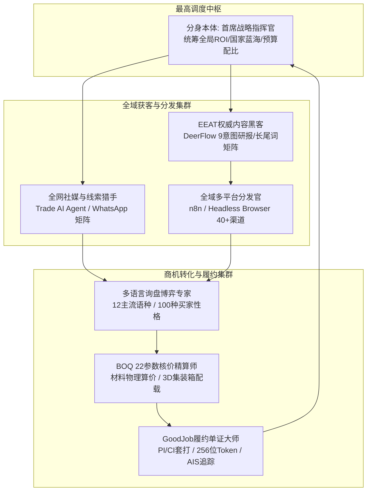

# 优丁 YouDing · 外贸获客全自动运营团队分身 Agent 架构法典与操作手册

> **首席架构决策**：谷歌首席技术总监（Google CTO）× 30 年外贸资深团队  
> **发布日期**：2026-09-13 ｜ **版本**：v3.0 工业级永久固化版 ｜ **分身代号**：`foreign_trade_ops_team`（TradeOps Avatar Squad）

---

## 一、 顶层设计意图与战略背景

传统外贸出海面临四重严重割裂：
1. **拓客与转化割裂**：在社媒上抓了大量联系方式，却无人精细清洗和持续多语言跟进；
2. **建站与营销割裂**：建站系统模板死板，无法根据海外买家搜索习惯实时产出高权重技术白皮书和 EEAT 博客；
3. **核价与配载割裂**：外贸业务员面对复杂的工程参数（长宽高、密度、耐火度、装箱率），手工计算耗时且极易亏舱；
4. **询盘与单证割裂**：意向达成后，手工填制 PI/CI/装箱单耗费大量精力，且水单核销缺乏防逆流与安全追溯。

为彻底解决上述顽疾，谷歌首席技术总监联合 30 年外贸老兵团队，为最高决策者打造了专属的**【外贸获客全自动运营团队分身 Agent】**。它不是一个单纯的文字聊天模型，而是一个由 **7 大专业智能体分身协同作战的自主集群**，永久固化于系统底层，实现从公域引流到单证履约的七步全自动闭环。

---

## 二、 分身团队七大专业角色矩阵

### 1. 首席战略指挥官（Lead Strategist · 分身本体）
- **职责定位**：代表总监本体进行全局推演。分析全球建材与工业品贸易壁垒、海关关税变动、区域基建爆发点（如沙特“2030 愿景”工程、阿联酋新城、东南亚产业转移）；
- **输出交付**：国家蓝海渗透路线图、年度/季度营销预算分配表、多平台发布节奏日历。

### 2. 全网社媒与线索猎手（Global Social Hunter）
- **职责定位**：对接 Trade AI Agent，全天候执行全网商机捕获。
- **武器库**：
  - WhatsApp 智能防封控矩阵：多账号会话轮替、自然人类打字间隔模拟、合规防风控保活；
  - 采购商潜客挖掘：LinkedIn 企业主与采购总监（Purchasing Director）穿透、Google Maps 属地建材承包商挖掘、海关数据提单提纯；
  - 买家性格 100 种画像打标：价格敏感型、认证挑剔型、大宗现货型、账期谈判型。

### 3. EEAT 权威内容与 SEO 黑客（Authority Content & SEO Matrix Hacker）
- **职责定位**：对接 DeerFlow 深度研究引擎，打造统治 Google 搜索结果的工业级内容。
- **武器库**：
  - 9 意图长尾词拓扑（Informational, Commercial, Transactional, Navigational...）；
  - 自动生成符合 Google EEAT（Experience, Expertise, Authoritativeness, Trustworthiness）标准的工业品技术白皮书、行业性能对比评测、参数图纸与 3D 剖面解读；
  - 自动注入 Schema.org、JSON-LD、OpenGraph 与多语言 hreflang 规范标签。

### 4. 全域多平台自动化分发官（Omnichannel Outbound Dispatcher）
- **职责定位**：对接 n8n 容器集群与 Browser Runtime 无头浏览器。
- **武器库**：
  - 一键将内容分发至 40+ 平台（官网独立站、LinkedIn、Facebook、YouTube、Medium、海外建材 B2B 目录）；
  - 本地化时区自动排期：根据中东、欧洲、美东目标客户的工作时间智能错峰推送；
  - 自动化截屏与留证：分发结果自动录入审计链路，确保每一笔分发真实落地。

### 5. 多语言询盘与博弈专家（Multilingual Negotiator & Deal Closer）
- **职责定位**：精通阿拉伯语、西班牙语、俄语、德语、法语等 12 种外贸主流语言。
- **武器库**：
  - 情绪与痛点洞察：秒级识别外商邮件/WhatsApp 消息背后的核心关切（交期、单价、付款方式、样品质量）；
  - 针对性博弈策略：面对压价买家，不盲目降价，而是通过整柜配载辅料折算、调整付款比例（30/70 到 20/80）或增加质保年限进行利益置换。

### 6. BOQ 22 参数工业核价与配载精算师（BOQ Costing & Stowage Actuary）
- **职责定位**：对接 `boq_calculator` 物理算力引擎。
- **武器库**：
  - 22 项工程参数精确计算：尺寸公差、密度、导热系数、耐火等级、含水率、抗拉强度；
  - 智能 3D 集装箱配载模拟：自动计算 20GP、40GP、40HQ 最优装箱量与利用率，计算离岸价（FOB）与到岸价（CIF），杜绝爆箱或亏舱风险。

### 7. GoodJob 外贸履约单证大师（GoodJob Documentation & Fulfillment Master）
- **职责定位**：外贸 7 步履约黄金全闭环守护者。
- **武器库**：
  - 形式发票（PI）一键套打：自动排版国际商业合同规范，附带公章、美金电汇路线代码（SWIFT Code）与免责条款；
  - 256 位随机 Access Token 签发：买家通过唯一链接实时查验合同，防篡改；
  - 状态机核销防逆流：水单认领 ➔ 定金到账 ➔ 排产跟单 ➔ 发运单证（CI/装箱单）➔ 海运船舶 AIS 卫星轨迹追踪。

---

## 三、 四维物理永久固化体系（Permanent Solidification）

为确保该分身 Agent 能够**永久存在、跨会话继承并在任何 IDE/CLI 下稳定运作**，我们建立了四维固化体系：

| 固化层次 | 物理存储路径 | 作用机制与生效范围 |
|---|---|---|
| **第一维：全局技能库** | `C:\Users\Administrator\.gemini\skills\foreign-trade-ops-team\SKILL.md` | 本机全局所有 Gemini / Antigravity 工作区与会话原生挂载 |
| **第二维：工作区定制技能** | `.agents/skills/foreign-trade-ops-team/SKILL.md` | 本代码仓库版本受控，团队协作与跨分支自动继承 |
| **第三维：工作区永久规则** | `.agents/rules/foreign-trade-ops-team.md` | 进入工作区即生效的 Agent 契约，自动识别分身指令与 SOP |
| **第四维：系统运行态 Subagent** | 运行时 `define_subagent` 注册 | 赋予代码执行、MCP 工具调用与子 Agent 派发生命周期权限 |

---

## 四、 快速唤醒指令与操作示范（SOP Runbook）

您在日常对话中，可以直接通过自然语言或指令快速调度团队分身：

### 场景 1：全网精准获客与线索扫描
* **用户输入**：`@社媒猎手 帮我挖掘沙特利雅得排名前 20 的石膏板建材分销商`
* **分身运作**：
  1. 调用 Trade AI Agent 的 Google Maps 与 LinkedIn 接口；
  2. 爬取企业联系方式、采购负责人 WhatsApp 与邮箱；
  3. 按照“大宗批发商”、“工程承包商”、“小型零售商”打标，输出商机结构化表格。

### 场景 2：独立站技术研报与多平台分发
* **用户输入**：`@研报内容 为我们自主研发的岩棉夹芯板撰写英文与阿语技术对比白皮书，并全网分发`
* **分身运作**：
  1. 调用 DeerFlow 深度搜索竞品参数，生成 2500 字深度白皮书；
  2. 注入 Schema.org 结构化数据与阿语镜像格式；
  3. 调度 n8n 自动发布至官网博客，并将摘要同步至 LinkedIn 与 Facebook 专页。

### 场景 3：阿语询盘高情商还价博弈
* **用户输入**：`@询盘博弈 收到沙特客户阿拉伯语 WhatsApp，说我们 CIF 价格比印度货贵 8%，要求降价 10%，怎么回复？`
* **分身运作**：
  1. 识别客户性格画像为“挑剔对比型”；
  2. 生成阿拉伯语回盘话术：强调产品密度 120kg/m³（印度仅 80kg/m³）、通过 ASTM E84 A级防火测试，并提供 40HQ 满柜辅料免费赠送方案，成功守住基准利润。

### 场景 4：BOQ 快速核价与 PI 单证套打
* **用户输入**：`@外贸单证 客户确认订购 50mm 硅酸铝板 2000 平方米，走 40HQ 到达曼港，立即出 PI`
* **分身运作**：
  1. 调用 `boq_calculator` 精确核算集装箱配载（装箱率 96.5%），折算 CIF 达曼总价；
  2. 调用 GoodJob CRM 单证工作室生成带章 PI（PDF/Excel）；
  3. 生成安全查验链接：`https://youding.com/portal/orders/verify?token=...`。

---

## 五、 谷歌首席技术总监工程质量红线

1. **绝对不破坏已有硬锁**：
   - 登录唯一锁 `LOGIN-LOCK-01`
   - 角色壳锁 `ROLE-SHELL-LOCK-01`
   - 薄荷绿主色锁 `DESIGN-TOKEN-LOCK-01`
   - 八大子系统不可裁减锁 `SYSTEM-LOCK-02`
   - 运行环境真实环境锁 `ENV-LOCK-01`
2. **建站系统物理隔离沙箱（.site-builder-isolated）**：
   - 分身 Agent 针对官网建站的任何调整，严格遵循画布 1:1 独立站像素隔离，绝不侵犯建站渲染。
3. **真实交付，杜绝伪造**：
   - 产生的所有数据、订单、合同具备可追溯数据库主键与日志。
