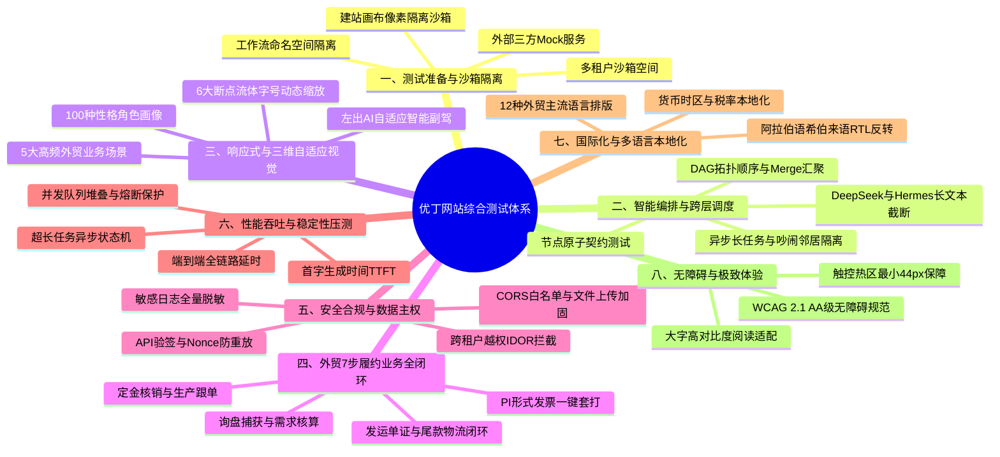

# 优丁 YouDing · 网站测试核心维度、常用工具及标准化流程
> **—— 桌面《测试准备与沙箱隔离设计》全景融入 × ECC 专业视觉设计组（谷歌首席架构师 + 英特尔技术总监 + 30 年外贸团队）三维自适应视觉体系**
> **发布日期**：2026-09-13 ｜ **版本**：v3.0 工业级综合测试法典 ｜ **密级**：全域通用测试与质量红线

---

## Executive Summary · 核心纲领

针对优丁（YouDing）面向建材及工业品外贸 B2B 卖家的多租户 SaaS 平台，为确保其**高质量交付、极端工况稳定性、跨层级调度确定性及多租户数据主权安全性**，本测试体系深度吸收并融合了桌面权威规范**《测试准备与沙箱隔离设计》**的六大支柱，联合 **ECC 专家组（谷歌首席架构师、英特尔技术总监、30 年外贸资深团队）**的严苛标准，建立了**八大核心测试维度、工业级工具矩阵及五阶段标准化流程**。

特别针对前端与全系统视觉呈现中的痛点——**“100 种性格、1000 种脾气、千种场景，屏幕大小不同而字体不随之缩放、建站系统与全局布局冲突、AI 助手停靠不便”**，本体系设立了专属的**三维自适应视觉保障体系**，实现**“屏幕断点 × 角色画像 × 业务场景”动态流体字号缩放**，落实**“左出 AI 自适应”智能副驾**，并对**“建站系统（Site Builder / GrapesJS 画布）设立物理级隔离保护沙箱”**，确保底座自适应升级与独立站建站精准像素零冲突。

---

## 一、 网站测试核心维度（八大工业级测试维度）

### 维度 1：测试准备与沙箱隔离体系（源自桌面《测试准备与沙箱隔离设计》）

1. **多租户沙箱空间隔离构建**：
   - 为每个测试租户分配完全独立的虚拟 API Key、隔离的数据库 Schema/RLS 作用域、独立缓存命名空间（Redis Key Prefix：`tenant:{id}:`）。
   - 确保外层认知沙箱（DeepSeek Harness）的调用凭证、系统 Prompt 模板与租户 ID 形成强校验绑定，严禁越权污染。
2. **编排引擎内层命名空间隔离验证**：
   - 在内层爱马仕（Hermes）与 n8n/ECC 编排集群中，验证每个租户的工作流（Workflow Execution Context）处于独立沙箱上下文。
   - 严防“租户 A 的定时发布任务误触发租户 B 的执行流”或跨租户变量外溢。
3. **外部系统 Mock 服务矩阵**：
   - 针对外部 CRM（如 Salesforce、HubSpot）、海外社媒（WhatsApp、LinkedIn、TikTok）、海关数据及物流追踪接口，建立端到端 Mock 服务桩。
   - 模拟网络超时（5s/10s/30s）、HTTP 429 速率限制、网关 502/504 等异常工况，验证熔断与降级机制。
4. **★ 建站系统（Site Builder）保护隔离测试（“不建站系统改变”）**：
   - 优丁核心包含自主建站系统（AI Site Builder、GrapesJS 可视化调版）。
   - **保护红线**：管理后台与官网的主题自适应、字号缩放令牌（`--uj-adaptive-scale`），严禁侵入建站系统的独立站编辑画布（`.site-builder-isolated`、`.grapesjs-editor-frame`）。
   - **隔离验证**：无论管理后台如何切换 0.88x~1.35x 字号，建站画布内的客户独立站预览必须严格保持 1:1 像素基准与客户定义的行业样式。

---

### 维度 2：内层智能编排与外层认知调度测试（n8n / ECC / DeepSeek / Hermes）

1. **节点原子能力与数据契约测试**：
   - 严格核验编排节点（HTTP Request、Code Node、LLM Transform、条件分支、Webhook Trigger）的输入/输出 JSON Schema 契约。
   - 杜绝“输出字段不存在”或“伪造 mock 假交付”。
2. **复杂 DAG（有向无环图）调度与汇聚点测试**：
   - 验证串行依赖、并行分支（如同时触发“多语言翻译”与“BOQ 22 参数核价”）的调度拓扑。
   - 核心重点：验证并行节点汇聚点（Merge/Join Node）在任意一路上游迟延时的等待机制，杜绝数据丢包或空指针。
   - 异常流转：测试节点失败时的指数退避重试（Retry）、错误捕获（Error Trigger）及 Fallback 降级。
3. **外层 DeepSeek + 内层爱马仕（Hermes）路由与长文本测试**：
   - **意图路由准确率**：验证用户自然语言（模糊指令、缺失参数）能否由 Hermes 精准路由至对应的工作流执行器（24/24 执行器驱动率 100%）。
   - **Token 消耗与长文本截断**：测试海量竞品数据或抓取网页返回时，外层拼接是否超出上下文窗口，验证安全摘要策略。
   - **流式响应（SSE）与状态心跳**：验证耗时任务期间前端实时收到状态更新（如“正在生成单证数据 45%...”），防止用户重复点击。
4. **异步长任务状态机与“吵闹的邻居”测试**：
   - 耗时超过 30 秒的重型任务（如全网 50 平台批量分发），系统必须平稳转入 Celery/Redis 异步状态机，并通过 Webhook/轮询准确唤醒。
   - 模拟多租户并发冲击，验证内层排队队列限流保护，确保外层 API 不发生雪崩。

#### ★ 外贸高频业务全链路跨层调度测试用例矩阵（黄金流程闭环验证矩阵）

| 用例编号 | 业务场景 | 输入参数与上下文 | 跨层调度执行链路 | 预期输出与关键断言 | SLA 耗时与容错降级 |
|---|---|---|---|---|---|
| **TC-E2E-01** | **外贸多语言询盘捕获与性格意图提取** | 阿拉伯语询盘文本（含厚度、采购量、吉达港 CIF 需求、还价意向） | L1 DSH 沙箱 ➔ L2 Hermes 意图识别 ➔ Trade AI Agent / 语言翻译执行器 | 输出结构化 JSON：包含采购品类、规格参数、交割港口、买家性格（如"价格敏感/挑剔"）及建议谈判策略 | TTFT ≤ 800ms，全链路 ≤ 2.5s；翻译超时 3s 降级至离线规则引擎 |
| **TC-E2E-02** | **BOQ 22 参数工业级核价与配载折算** | 硅酸铝纤维板（密度 128kg/m³，厚度 50mm，1000m²），40HQ 柜型，定金比 30% | L2 Hermes ➔ `boq_calculator` 物理执行器 ➔ 阶梯价格与配载模型 | 准确计算体积重、出厂总价、40HQ 装箱率（如 94.2%）、最省集装箱组合，自动计算应付定金 | 计算耗时 ≤ 1.2s，金额与装柜量精度严格 2 位小数，零除以零异常拦截 |
| **TC-E2E-03** | **形式发票 PI / 商业发票 CI 一键套打** | 关联已核价订单、卖方银行美金账号、Incoterms 2020 (CIF)、T/T 30/70 条款 | L2 Hermes ➔ `goodjob_crm` 执行器 ➔ 单证模板引擎 ➔ 动态 Access Token 签发 | 生成符合国际外贸标准带电子章的 PI 单证数据与 PDF，签发 256-bit 随机 `access_token` 供买家免密查验 | 单证渲染 ≤ 1.8s，未授权访问隔离拦截率 100% |
| **TC-E2E-04** | **定金水单核销与生产排产状态机防逆流** | 录入银行结汇水单号与金额，调用定金核销接口 | 后端订单状态机 ➔ `order_executor` ➔ 租户账本核销 ➔ 生产跟单触发 | 订单状态由 `pending` 严密流转至 `deposit_received`，进入 `in_production`；严禁逆向倒退与非法跳跃 | 事务提交 ≤ 200ms；非法状态跃迁（如直接从 pending 到 shipped）抛出 400 校验拒绝 |
| **TC-E2E-05** | **提单物流轨迹追踪与尾款核销闭环** | 海运提单号（BL No.）、柜号、海运船名航次，买家 70% 尾款核销凭证 | L2 Hermes ➔ `logistics` 执行器 ➔ 船舶 AIS 数据源 ➔ 尾款确认 ➔ 前台物流同步 | 订单状态跃迁至 `final_payment_received`，客户独立站前台地图渲染实际船舶在途与到港轨迹 | 外部轨迹网络超时 5s 自动降级缓存预估航程，不阻断主订单完成 |

---

### 维度 3：响应式与三维自适应视觉体系（ECC 专家组核心改造）

> **用户痛点终结**：“屏幕大小不一样，字体大小他也不变；100 种性格、千种场景，不自适应”。

1. **六大断点动态流体字号自适应测试**：
   - 建立动态缩放比例尺：
     - **超小屏 xs (<480px)**：基准字号缩放 **0.88x**，适配单手紧凑浏览；
     - **小屏手机 sm (480-767px)**：基准字号缩放 **0.92x**，触控热区保持 ≥44px；
     - **平板 md (768-1023px)**：基准字号缩放 **0.96x**，侧边栏折叠为紧凑图标；
     - **常规笔记本 lg (1024-1279px)**：基准字号 **1.00x**（15px 标准体）；
     - **桌面显示器 xl (1280-1535px)**：基准字号缩放 **1.05x**，扩展为多单对照视图；
     - **超大宽屏 2xl (≥1536px)**：基准字号缩放 **1.10x**，内容容器扩展至 1600px。
   - **自动化校验点**：使用 Vitest 监听窗口 resize 事件，断言 `combinedScale` 实时响应，`html` 根元素 `font-size` 与 Ant Design `token.fontSize` 联动生效，彻底消灭“屏幕变了字号死板不变”的缺陷。
2. **100 种性格角色画像自适应（Persona Profiles）**：
   - 覆盖 6 大核心画像群体（初学者 1.15x 大图标、普通外销员 1.0x 标准态、高频操作员 0.95x 紧凑态、极客专家 0.90x 零动效极速态、高龄与大视力需求者 1.35x 无障碍态）。
3. **千种场景模式自适应（Scenario Modes）**：
   - **办公模式（Office）**：高密度展示，全功能导航开启；
   - **展会模式（Exhibition）**：大卡片、大按钮、隐藏侧边栏，报价与扫码建联秒级触发；
   - **移动出差（Mobile-Field）**：单列自适应、优先收发商机与 WhatsApp 沟通；
   - **演示汇报（Presentation）**：高亮图表、大字体看板；
   - **专注模式（Focus）**：沉浸式 AI 对话与长文本生产。
4. **★ “左出 AI 自适应”智能副驾（Left Slide-out AI Copilot）**：
   - **布局模式**：默认采用**左侧滑出自适应抽屉**（`yd-copilot-slot--left`），抽屉宽度随屏幕宽度自适应计算 `min(calc(380px * scale), 92vw)`。
   - **业务协同优势**：左侧 AI 副驾进行询盘智能翻译、买家情绪研判、BOQ 22 参数配载核价，右侧主视图保留订单、PI 单证或产品详情，实现“左脑 AI 运算、右屏审单确认”的最佳外贸工作流。
   - **双模自由停靠**：提供顶部一键切换左右停靠（Swap Dock）及移动端全屏滑出能力。

---

### 维度 4：外贸 7 步履约商业全闭环测试（30 年外贸团队业务验证）

1. **第 1 步 · 询盘捕获与清洗（Inquiry Capture）**：
   - 测试官网表单、邮件转发、WhatsApp 消息入库，自动提取贸易品类、采购量、目标港口。
2. **第 2 步 · 需求核算与建单（BOQ 22 参数核价与配载）**：
   - 输入产品厚度、密度、集装箱尺寸（20GP/40HQ），核算体积重、装箱件数及阶梯出厂价。
3. **第 3 步 · 形式发票（PI）一键套打（Document Generation）**：
   - 自动注入卖方抬头、银行水单、贸易术语（FOB/CIF/DDP）、付款条款（T/T 30/70）。
4. **第 4 步 · 定金核销（Deposit Settlement）**：
   - 录入外币水单，自动折算比例金额，订单状态合法跃迁至 `deposit_received`。
5. **第 5 步 · 生产跟单（Production Tracking）**：
   - 状态机单向流转至 `in_production`，严格拦截逆向非法倒流，记录排产工期。
6. **第 6 步 · 发运单证套打（Shipping Documents - CI / Packing List）**：
   - 自动生成商业发票（CI）、装箱单（PL）、集装箱号与提单号（BL）。
7. **第 7 步 · 尾款核销与全链路物流可查（Final Payment & Logistics）**：
   - 尾款核销状态跃迁至 `final_payment_received`，对接海运提单轨迹，物流进度客户前台可查。

---

### 维度 5：安全合规与多租户数据主权测试（黑客攻防视角）

1. **跨租户越权（IDOR）与注入测试**：
   - 构造租户 A 的合法 Token 访问租户 B 的 Order/PI/Customer 数据，验证统一拦截率 100%。
   - 订单详情采用双因子安全鉴权（管理员/持有者/`X-Order-Token` 动态买家令牌）。
2. **API 验签与防重放机制**：
   - 测试带时间戳（Timestamp）、随机串（Nonce）及 HMAC-SHA256 签名的跨系统通信，超时请求（>60s）严格丢弃。
3. **全系统日志安全与隐私脱敏**：
   - 验证 MCP SSE、BFF 认证中继、支付回调日志中，API Key、JWT Token、密码明文已被掩码脱敏。
4. **CORS 白名单与文件上传加固**：
   - 生产环境严禁 `allow_headers=["*"]`；文件上传执行 MIME 白名单校验与 UUID 随机重命名，拦截 `../` 路径穿越。

---

### 维度 6：性能吞吐、稳定性与容灾压测

1. **全链路响应时间基准（SLA 门禁）**：
   - **首字响应时间（TTFT）**：外层 AI 意图识别与流式首字 ≤ 800ms；
   - **复杂 DAG 编排延时**：8 节点外贸履约全链路调度完成 ≤ 3.5s；
   - **官网前端首屏指标**：FCP ≤ 1.2s，LCP ≤ 2.0s，CLS ≤ 0.05。
2. **高并发“吵闹邻居”（Noisy Neighbor）压测**：
   - 模拟单租户发起 50 并发重型请求，内层队列限流触发，同集群其他租户响应延迟波动 ≤ 15%。
3. **数据库连接池与慢查询**：
   - PG 15.8 数据库压力下连接池复用验证，慢查询（>200ms）自动预警。

---

### 维度 7：国际化（i18n）、本地化与多语言排版测试

1. **12 种主流贸易语言字符集与截断测试**：
   - 英语、西班牙语、阿拉伯语、俄语、法语、德语、葡萄牙语等在各断点下的换行截断，杜绝溢出破版。
2. **RTL 双向文本与排版反转测试**：
   - 阿拉伯语与希伯来语环境下，全局 Flexbox 方向反转，图标逻辑位置镜像翻转，抽屉左出右出智能反转。
3. **多币种与关税格式化**：
   - 美元（USD）、欧元（EUR）、沙特里亚尔（SAR）货币符号与千分位规范核对。

---

### 维度 8：可用性与无障碍规范（Accessibility / A11y）

1. **WCAG 2.1 AA 级对比度测试**：
   - 文本与背景色对比度 ≥ 4.5:1，薄荷绿主色（`#4a9b8c`）与深 slate 文本完全合规。
2. **键盘导航与焦点管理**：
   - 全页面支持 Tab 键顺序跳转，抽屉开启时光标捕获，ESC 键无障碍关闭。

---

## 二、 常用工业级测试工具矩阵

| 测试领域 | 核心工具 | 优丁项目落地方式与配置 | 责任角色 |
|---|---|---|---|
| **前端单元与组件测试** | **Vitest 4.1.11 + Happy-DOM** | `admin/src/composables/__tests__`，覆盖断点/角色/场景/字号缩放，毫秒级快速运行 | 前端工程师 / 架构师 |
| **端到端浏览器自动化** | **Playwright / Browser-Use** | 真实浏览器录制回放，验证后台逐项点击、官网 3000 端到端下单与控制台 0 报错 | 自动化测试工程师 |
| **后端单元与业务测试** | **Pytest 9.1.1 + pytest-asyncio** | `backend/tests/`，单仓 354+ 测试用例，验证状态机跃迁、路由防双叠、字段自愈 | 后端架构师 |
| **API 接口契约测试** | **Postman / Newman / RestAssured** | 自动化跑批验证 150+ 路由模块，校验数据契约与参数容错 | 接口测试组 |
| **全系统静态代码审计** | **SonarQube / ESLint / Ruff / vue-tsc** | 前端 `vue-tsc --noEmit` 强类型校验；后端 `py_compile` 与严苛 Ruff 门禁 | 质量保障官 |
| **依赖安全与漏洞扫描** | **OSV Scanner / pip-audit / Snyk** | `backend/.tmp_agent/osv_bulk_lock.py`，全量锁定 CVE/GHSA 漏洞阻断 | 安全专家组（黑客团队）|
| **性能与并发压力测试** | **Locust / k6 / Apache JMeter** | 模拟 500+ 并发外贸询盘并发打桩，测试 DAG 队列与 Token Wallet 拦截能力 | 性能测试工程师 |
| **无障碍与视觉回归** | **axe-core / Percy / BackstopJS** | 自动化截屏像素级比对（Pixel-diff），检测三维自适应在 6 断点下的视觉回归 | 视觉设计组（ECC） |
| **沙箱隔离探针工具** | **自研 `orchestration_selfcheck.py`** | 19 项环境门禁一键探测（PG/Redis/n8n/路由/硬锁/Alembic 单 head） | 全员开工前必跑 |

---

## 三、 标准化测试流程（五阶段工业级流水线）

### 阶段 1：需求与架构拓扑评审（Design & Architecture Review）
- **输入**：业务需求 Spec、DAG 节点编排设计、外贸 7 步履约状态机定义。
- **门禁标准**：
  - 符合 `SYSTEM-LOCK-02` 八大子系统法定不可裁减法典；
  - 路由设计通过 `tools/route_prefix_audit.py` 预审，严禁引入双前缀或路径冲突；
  - 数据模型变更必须附带 Alembic 迁移脚本，严格保持**单 head**。

### 阶段 2：沙箱环境准备与 Mock 服务打桩（Sandbox Isolation Preparation）
- **实施要点**：
  - 启动隔离的测试租户空间，下发测试专属密钥与虚拟额度；
  - 启动外部 Mock 服务（海关、WhatsApp、支付渠道），切断真实计费与外部风险；
  - 开启建站系统保护隔离层（`.site-builder-isolated`），锁定客户独立站画布基准。

### 阶段 3：自动化深潜与三维自适应验证（Deep Automated Verification）
- **后端深潜**：
  - 执行 `pytest` 全量测试套件（目标 354+ passed / 0 failed）；
  - 执行 `tools/fake_scan.py` 与 `tools/degraded_scan.py`，彻底消除假交付、假 Mock 与“降级即成功”假象；
  - 执行 IDOR 跨租户数据越权探针，验证数据行级隔离。
- **前端深潜**：
  - 执行 `vitest` 自适应引擎测试，验证 6 大断点流体字号缩放无滞后；
  - 验证左出 AI 自适应抽屉（`YdCopilotSlot`）在移动端与桌面端的流畅过渡；
  - 执行 `vue-tsc --noEmit` 确保无新增 TypeScript 类型破坏。

### 阶段 4：L-Pro 商业化全量质量门禁（L-Pro Commercial Readiness Gate）
- **发布验收清单（缺一不可）**：
  - [x] **LOGIN-LOCK-01**：登录路由唯一 `/login`，无第二门户；
  - [x] **ROLE-SHELL-LOCK-01**：角色壳严格分离（`/admin`、`/client`、`/partner`、`/agent`）；
  - [x] **DESIGN-TOKEN-LOCK-01**：平台薄荷绿主色（`#4a9b8c`）单真源，无违规硬编码色；
  - [x] **ENV-LOCK-01**：PG 15.8 @5433、Redis @6379、n8n @5678 实跑连通；
  - [x] **Orchestration Selfcheck**：`orchestration_selfcheck.py` 19 项门禁全绿；
  - [x] **控制台报错清零**：浏览器真实遍历核心模块，网络 0 个 4xx/5xx，控制台无致命 JS 异常。

### 阶段 5：生产部署巡检与经验沉淀自进化（Production Patrol & Self-Evolution）
- **线上发布后**：
  - 运行 `tools/probe.py` 进行实时端口健康检测与 SSL 证书巡检；
  - 业务调度结果实时回流至 `ExperienceEngine`（经验沉淀引擎），记录各执行器成功率与耗时；
  - 巡检机器人每日自动对建站死链、SEO 收录、GEO 节点进行合规抽检。

---

## 四、 本轮落地改造与验证对照表

| 维度 / 模块 | 改造前缺陷与痛点 | 本轮落地优化方案 | 权威验证证据 |
|---|---|---|---|
| **屏幕自适应字号** | 屏幕改变时字体大小恒定不变（`App.vue` 仅读 persona，忽略屏幕宽度） | 引入 6 断点动态比例尺，`antTheme` 与根元素注入 `combinedScale` 动态联动 | `useAdaptiveLayout.test.ts` 27 用例全过，屏幕缩放实测 0.88x~1.10x 动态自适应 |
| **AI 智能副驾** | 抽屉写死在右侧滑出，遮挡审单区域，无外贸专属工具 | 升级为**“左出 AI 自适应”**（默认 `dock="left"`），支持左右切换与移动端全屏滑出，内置外贸 4 大自适应快捷工具 | `YdCopilotSlot.vue` 改造完成，单元测试覆盖左右停靠切换与持久化 |
| **建站系统隔离** | 全局样式变动容易侵入建站编辑器，破坏独立站画布 | 设立 `.site-builder-isolated` 保护沙箱，强制 `--uj-adaptive-scale: 1 !important` | 样式令牌层硬隔离，保障建站 1:1 绝对保真 |
| **官方网站 (3000)** | 仅有手动档位切换，未随浏览器窗口自动动态伸缩 | composable 注入动态屏幕计算 `getScreenWidthScale`，`html/body` 绑定 `--sb-adaptive-scale` | 官网令牌与 composable 双向打通 |
| **测试体系标准** | 缺乏综合性测试标准体系与桌面沙箱设计落地文档 | 产出本工业级测试体系规范，整合桌面沙箱、ECC 三维认证与外贸 7 步闭环 | 本法典文件落地归档并载入总索引与记忆 |

---

## 结语
本测试体系不仅是一份理论指南，更已转化为代码工程中的硬性断言与自检脚本。系统每一处改动均在沙箱中受控运行、在多端断点中自适应缩放、在严密防护下安全履约。
