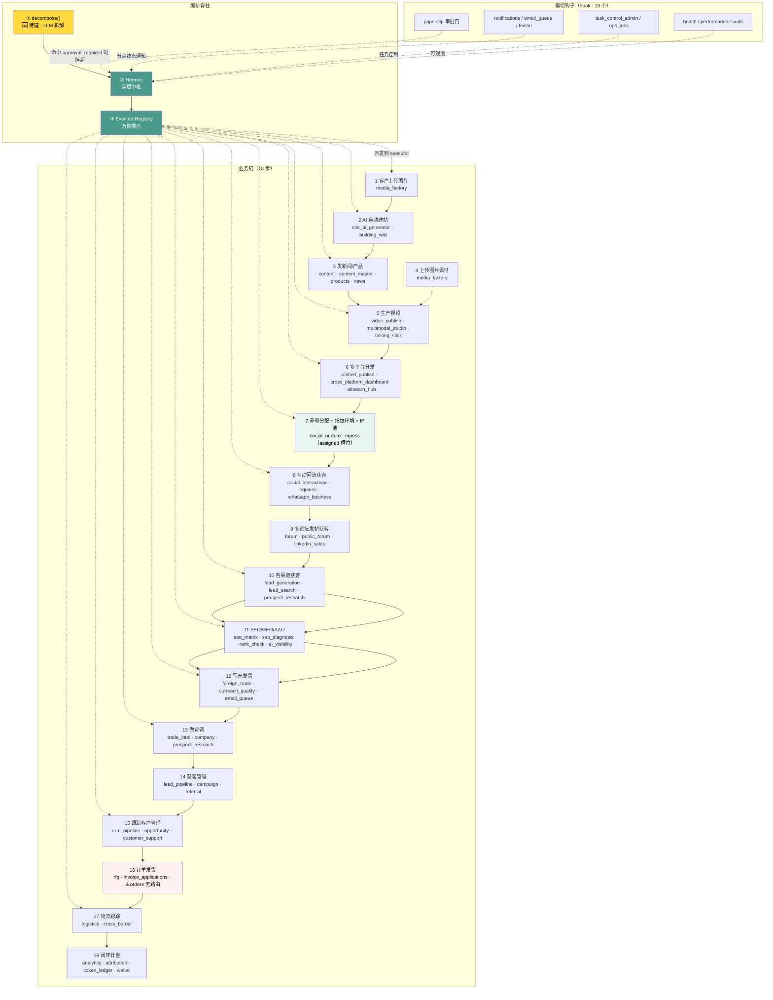

# 能力串联接线图 · 业务链 × 模块 × 编排层

> **日期**：2026-09-10 ｜ **产出于**：`tools/capability_tags.py`（归属表）+ 源码实测
> **状态**：**149 个模块全部有归属，未归类 = 0** ✅
> **配套**：`docs/能力台账/归属表.md`（逐模块标签）

---

## 一、归属结果（可机械验收）

| 标签 | 含义 | 模块数 |
|---|---|---:|
| `orchestrated` | 已在编排链上 | 2 |
| **`to-orchestrate`** | **该进编排，待串** ← **主要工作量** | **112** |
| `hook` | 横切钩子（审批/通知/运维/可观测） | 19 |
| `backoffice` | 后台管理，明确不进编排 | 16 |
| `deprecated` | 待废弃 | 1 |
| **合计** | | **150** |
| `UNTAGGED` | **未归类** | **0 ✅** |

**「不缺」已达成**——每个模块都有归属，没有悬空的。剩下的是把 112 个 `to-orchestrate` 逐个串上。

---

## 二、接线总图 · 业务链 → 模块 → 编排层

> **S7（养号/分配/指纹/IP池）是本次新增的关键环**——它接在「分发」之后、「互动获客」之前：分发出账号 → 养号 → **给每个号分配指纹环境 + 独立静态 IP** → 才能安全地做互动获客。**没有这一环，多账号会被平台判定关联而封号。**

---

## 三、逐个模块的「接线点」（点对点）

| 业务步 | 模块 | 接进编排的方式 | 工作量 |
|---|---|---|---|
| 1·4 图片 | `media_factory` | 包 `media` executor | 小 |
| 2 建站 | `site_ai_generator` | 包 `site_builder` executor | 小 |
| 3 内容 | `content` / `content_master` | 包 `content` executor | 小 |
| 5 视频 | `video_publish` / `multimodal_studio` | 包 `media.video` capability | 中 |
| 6 分发 | `unified_publish` / `aitoearn_hub` | 包 `publish` executor（或走 n8n） | 中 |
| **7 养号** | `social_nurture` | 包 `nurture` executor | 小 |
| **7 指纹/IP** | `egress` | 包 `egress` executor（**分配槽位**） | 中 |
| 8 互动 | `social_interactions` / `inquiries` | 包 `engagement` executor | 小 |
| 9 论坛 | `forum` / `public_forum` | 包 `forum` executor | 小 |
| 10 获客 | `lead_*` / `prospect_research` | 包 `leadgen` executor | 中 |
| 11 SEO | `seo_matrix` / `seo_diagnosis` | 包 `seo` executor | 中 |
| 12 开发信 | `foreign_trade` / `email_queue` | 包 `outreach` executor | 中 |
| 13 背调 | `trade_intel` / `company` | 包 `research` executor | 小 |
| 14·15 CRM | `crm_pipeline` / `opportunity` | 包 `crm` executor | 中 |
| **16 订单** | — | ⛔ **需先补 `orders` 路由** | 中 |
| 17 物流 | `logistics` | 包 `logistics` executor | 小 |
| 18 计量 | `token_ledger` / `wallet` | 走 Model Gateway ledger（已存在） | 小 |

**接线方式统一**：每个模块写一个 `BaseExecutor` 子类（实现 `get_executor_name()` + `run()`），在 `executors/__init__.py` 注册一行。**约 50-100 行/个。**

---

## 四、16 个 hook 的接法（不是 executor）

`hook` 类**不该包成执行器**，而应挂进 Hermes 流程：

| 钩子 | 挂在哪 | 机制 |
|---|---|---|
| `paperclip` 审批门 | `GraphPolicies.approval_required` 命中时 | 契约字段已在，接审批服务即可 |
| `notifications` / `email_queue` / `feishu` | 节点终态回调 | `_notify_site_built` 已有先例，扩展即可 |
| `task_control_admin` / `ops_jobs` | 监督器层 | 已是 `advance_plan` 的一部分 |
| `health` / `performance` / `audit` | 旁路观测 | 只读，不阻断主链 |
| `annex` 票据 | 附属项目接入 | 已是 hook（签发短时票据） |
| `sales_task` | 任务队列 | 与 `ai_tasks` 对齐 |

---

## 五、16 个 backoffice 的豁免说明

`tenants` / `users` / `settings` / `system` / `platform` / BFF 接入层 —— **明确豁免，不进编排**。理由：这些是平台运营者的管理面，不是租户请求的自动化对象。**给它们打上 `backoffice` 标签，就是「有归属」了。**

> 注意：`auth`、`platform_bff` 等虽在 backoffice，但**是每条链的必经之路**（鉴权在前置）——它们不进编排 ≠ 不参与链路，而是**不成为编排节点**。

---

## 六、接线后的验收

| # | 判据 | 测法 |
|---|---|---|
| 1 | **未归类 = 0** | ✅ **已达成**（`tools/capability_tags.py` 输出） |
| 2 | `to-orchestrate` 全部 ✅ | 重跑 `tools/capability_ledger.py`，看串联率 |
| 3 | 一条命令打通全链 | 一句 intent → 产出覆盖 ≥8 步的 `TaskGraph` |
| 4 | hook 生效 | 命中 `publish.*` 时真挂起等审批 |

**串完之后，串联率应从 1.3% 升到 ≈75%**（112 / 150），剩下 16 个 backoffice + 1 个 deprecated 是刻意不串的。

---

*本接线图与 `docs/能力台账/归属表.md` 配套。归属表可重跑：`python3 tools/capability_tags.py`。*
